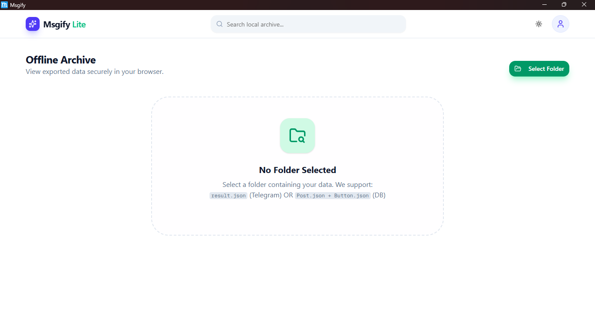

<div align="center">

# 📱 Msgify Lite – Offline Archive Viewer


**A powerful offline archive viewer for Telegram exports and database backups.**  
Access your data anytime, anywhere — no internet, servers, or cloud dependencies required.

[🖥️ Desktop App](#-desktop-app) • [🌐 Web Version](#-web-version) • [✨ Features](#-key-features) • [📖 Docs](#-usage-guide)

</div>

---

## 🚀 Installation

### 🖥️ Desktop App (Recommended)

<div align="center">




</div>

#### Quick Install (One-Liner)

**Linux/Mac:**
```bash
curl -fsSL https://raw.githubusercontent.com/miangee21/Msgify-Lite/desktop/install.sh | bash
```

**Windows (PowerShell as Administrator):**
```powershell
irm https://raw.githubusercontent.com/miangee21/Msgify-Lite/desktop/install.ps1 | iex
```

#### Manual Download

| Platform | Download | Size |
|----------|----------|------|
| **Windows** | [📥 MSI Installer](https://github.com/miangee21/Msgify-Lite/releases/latest/download/Msgify_0.1.1_x64_en-US.msi) | ~3.5 MB |
| **Windows** | [📥 EXE Setup](https://github.com/miangee21/Msgify-Lite/releases/latest/download/Msgify_0.1.1_x64-setup.exe) | ~2.5 MB |
| **Linux (Debian/Ubuntu)** | [📥 DEB Package](https://github.com/miangee21/Msgify-Lite/releases/latest/download/Msgify_0.1.1_amd64.deb) | ~3.7 MB |
| **Linux (Fedora/RHEL)** | [📥 RPM Package](https://github.com/miangee21/Msgify-Lite/releases/latest/download/Msgify-0.1.1-1.x86_64.rpm) | ~3.7 MB |
| **Linux (Universal)** | [📥 AppImage](https://github.com/miangee21/Msgify-Lite/releases/latest/download/Msgify_0.1.1_amd64.AppImage) | ~10 MB |

> **💡 Tip:** MSI for Windows and DEB/RPM for Linux provide automatic updates and system integration.

---

### 🌐 Web Version

Try Msgify Lite directly in your browser — no installation required!

<div align="center">

**[🌐 Open Web App](https://msgify-lite.vercel.app/)** • **[📂 Web Source Code](https://github.com/miangee21/Msgify-Lite/tree/main)**

</div>

**Branches:**
- `main` → Web version (Next.js)
- `desktop` → Desktop app (Tauri)

---

## ⚡ Desktop vs Web Comparison

| Feature | 🖥️ Desktop App | 🌐 Web Version |
|---------|---------------|---------------|
| **Speed** | ⚡ 10-20x faster | Standard |
| **Offline Access** | ✅ Full offline | ⚠️ Requires initial load |
| **Memory Usage** | 🟢 90% less | Standard |
| **File Access** | ✅ Native system dialogs | ⚠️ Browser limitations |
| **Startup** | ✅ Beautiful splash screen | Instant |
| **Installation** | Required (~3-10 MB) | None |
| **Auto Updates** | ✅ Built-in (future) | Always latest |
| **System Integration** | ✅ Native app icon, tray | Browser tab |

**🎯 Recommendation:** Use **Desktop App** for best performance and offline reliability.

---

## ✨ Key Features

### 🛡️ Security & Independence
- **Zero Dependencies:** Runs completely locally without backend, database, or external APIs
- **Privacy First:** Your data never leaves your device — all processing happens client-side
- **100% Offline:** No internet required after installation
- **Disaster Recovery:** Access archived data even if the main service is unavailable

### 📂 Smart Format Detection
Automatically detects and parses multiple data structures:
- **Telegram Desktop Export** – Standard `result.json` format
- **Custom JSON Arrays** – Simplified, flattened structures  
- **Database Reconstruction** – Parses raw `Posts.json` and `Button.json` exports

### ⚡ Premium Performance
- **Lazy Loading** – Images load on-demand (10-20x faster than traditional methods)
- **Instant Search** – Real-time filtering by text and metadata
- **Smart Caching** – Loaded images stay in memory for instant re-display
- **Intelligent Tagging** – Auto-detects and filters by available tags
- **Responsive Grid** – Beautiful masonry layout adapts to any screen size
- **Dark Mode Ready** – Fully themeable Telegram-inspired interface

---

## 🛠️ Tech Stack

### Desktop App (Tauri)
| Category | Technology |
|----------|-----------|
| **Framework** | [Tauri 2.x](https://tauri.app/) + [Next.js 15](https://nextjs.org/) |
| **Language** | [TypeScript](https://www.typescriptlang.org/) + [Rust](https://www.rust-lang.org/) |
| **UI** | [React](https://react.dev/) + [Tailwind CSS](https://tailwindcss.com/) |
| **Components** | [Shadcn/UI](https://ui.shadcn.com/) + [Lucide Icons](https://lucide.dev/) |
| **File System** | Native Tauri APIs (Rust backend) |

### Web Version
| Category | Technology |
|----------|-----------|
| **Framework** | [Next.js 15](https://nextjs.org/) (App Router) |
| **Language** | [TypeScript](https://www.typescriptlang.org/) |
| **Styling** | [Tailwind CSS](https://tailwindcss.com/) |
| **UI Components** | [Shadcn/UI](https://ui.shadcn.com/) |
| **Icons** | [Lucide React](https://lucide.dev/) |
| **State** | [React Hooks](https://react.dev/reference/react/useState) |

---

## 📖 Usage Guide

### Step 1: Launch the Application
- **Desktop:** Open from Start Menu (Windows) or Applications (Linux)
- **Web:** Visit [msgify-lite.vercel.app](https://msgify-lite.vercel.app/)

### Step 2: Select Your Data Folder
Click the **"Select Folder"** button and choose your data source:

- **For Telegram Exports:** Select the folder containing `result.json` and the `photos` directory
- **For Database Exports:** Select the folder with `Posts.json`, `Button.json`, and `photos`

### Step 3: Browse & Search
Once loaded:
- Use the **Search Bar** to find specific posts by text
- Apply **Tag Filters** to sort and categorize content
- Navigate through pages using the pagination controls
- Enjoy a beautiful, responsive grid layout

### Step 4: Offline Access
- **Desktop App:** Works completely offline after installation
- **Web Version:** Requires initial internet connection to load, then works offline

---

## 🚀 Need More Features? Try Msgify Pro

**[Msgify Pro](https://msgify-pro.vercel.app/)** is the full-featured, production-ready version with cloud storage, database, and advanced features.

### Msgify Pro Features
- ☁️ **Cloud Storage** – Cloudflare R2 integration for high-performance image delivery
- 🗄️ **Database** – PostgreSQL (Neon) + Prisma ORM for persistent data storage
- 🔐 **Authentication** – Secure JWT-based login and signup system
- 🏷️ **Smart Tagging** – Create, edit, and merge tags with automatic post migration
- 🗑️ **Safety Features** – Soft delete with recycle bin and restore functionality
- ⚡ **Bulk Operations** – Quick cleanup and batch processing capabilities
- 📊 **Dashboard** – Beautiful grid-based interface with advanced search and filtering

### Quick Links
- 🔗 **Live Demo:** [msgify-pro.vercel.app](https://msgify-pro.vercel.app/)
- 💻 **GitHub Repository:** [Msgify Pro](https://github.com/miangee21/Msgify)

---

## 🏗️ Development Setup

### Prerequisites
- **Node.js** 18.0.0 or higher
- **Rust** (for desktop app development)
- **npm** or **yarn**

### Web Version Setup

```bash
# Clone repository
git clone https://github.com/miangee21/Msgify-Lite.git
cd msgify-lite

# Install dependencies
npm install

# Run development server
npm run dev
```

Visit [http://localhost:3000](http://localhost:3000)

### Desktop App Setup

```bash
# Switch to desktop branch
git checkout desktop

# Install dependencies
npm install

# Run in development mode
npm run tauri dev

# Build for production
npm run tauri build
```

Built apps will be in `src-tauri/target/release/bundle/`

---

## 📂 Project Structure

### Desktop App
```
msgify-lite/ (desktop branch)
├── .github/
│   └── assets/               # Screenshots and media
├── src/
│   ├── app/
│   │   ├── layout.tsx        # Root layout with theme provider
│   │   ├── page.tsx          # Main app logic (parsers, state, rendering)
│   │   └── globals.css       # Global styles + animations
│   ├── components/
│   │   ├── ui/               # Reusable UI components (Shadcn)
│   │   ├── SplashScreen.tsx  # Startup splash screen
│   │   ├── lite-navbar.tsx   # Navbar with search functionality
│   │   ├── local-post-card.tsx # Post display component
│   │   └── local-pagination.tsx# Pagination component
│   └── lib/
│       └── utils.ts          # CSS utilities and helpers
├── src-tauri/
│   ├── src/
│   │   └── main.rs           # Rust backend entry point
│   ├── icons/                # App icons (all platforms)
│   ├── capabilities/         # Tauri permissions
│   └── tauri.conf.json       # Tauri configuration
├── install.sh                # Linux/Mac installer
├── install.ps1               # Windows installer
└── README.md                 # This file
```

### Web Version
```
msgify-lite/ (main branch)
├── src/
│   ├── app/
│   │   ├── layout.tsx
│   │   ├── page.tsx
│   │   └── globals.css
│   ├── components/
│   │   └── [same as desktop]
│   └── lib/
│       └── utils.ts
├── public/                   # Static assets
└── README.md
```

---

## 🤝 Contributing

Contributions are welcome! Help improve Msgify Lite:

1. **Fork** the repository
2. **Create** a feature branch: `git checkout -b feature/YourFeature`
3. **Commit** your changes: `git commit -m "Add YourFeature"`
4. **Push** to the branch: `git push origin feature/YourFeature`
5. **Open** a Pull Request

### Branch Guidelines
- `main` → Web version development
- `desktop` → Desktop app development
- Feature branches → New features or fixes

---

## 📝 Changelog

### v0.1.1 (Latest) - February 14, 2026
- ✨ Added beautiful splash screen on app startup
- 🚀 Implemented lazy loading (10-20x faster)
- 💾 Reduced memory usage by 90%
- 🐛 Fixed image loading issues
- 🔧 Improved folder selection dialog

### v0.1.0 - Initial Release
- 🎉 First public release
- 📂 Support for Telegram & DB exports
- 🔍 Search and tag filtering
- 🎨 Dark mode support

[View All Releases](https://github.com/miangee21/Msgify-Lite/releases)

---

## 📄 License

This project is licensed under the **MIT License**. See the [LICENSE](LICENSE) file for details.

---

## 🌟 Credits & Acknowledgments

- **[Tauri](https://tauri.app/)** – Lightweight desktop framework
- **[Shadcn/UI](https://ui.shadcn.com/)** – Beautiful, accessible component library
- **[Vercel & Next.js](https://nextjs.org/)** – Next-generation React framework
- **[Telegram Desktop](https://desktop.telegram.org/)** – Data export format reference
- **Community Contributors** – Your support drives innovation

---

## 🔗 Links

- 📦 **Desktop Releases:** [GitHub Releases](https://github.com/miangee21/Msgify-Lite/releases)
- 🌐 **Web App:** [msgify-lite.vercel.app](https://msgify-lite.vercel.app/)
- 💻 **Source Code (Web):** [main branch](https://github.com/miangee21/Msgify-Lite/tree/main)
- 🖥️ **Source Code (Desktop):** [desktop branch](https://github.com/miangee21/Msgify-Lite/tree/desktop)
- 🚀 **Msgify Pro:** [msgify-pro.vercel.app](https://msgify-pro.vercel.app/)

---

<div align="center">

**Made with ❤️ by the Msgify Team**

[⭐ Star on GitHub](https://github.com/miangee21/Msgify-Lite) • [📧 Report Issues](https://github.com/miangee21/Msgify-Lite/issues)

**Support the Project:**  
If you find Msgify Lite useful, consider giving it a star ⭐ on GitHub!

</div>